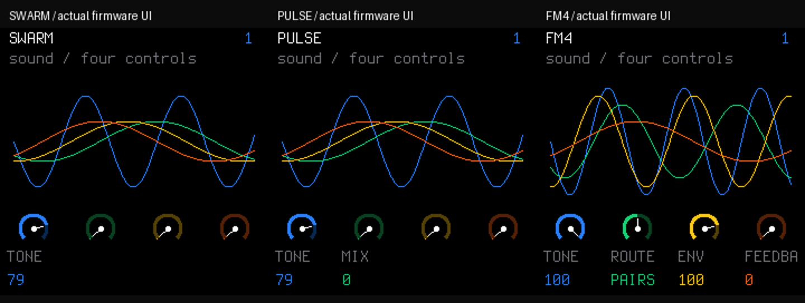
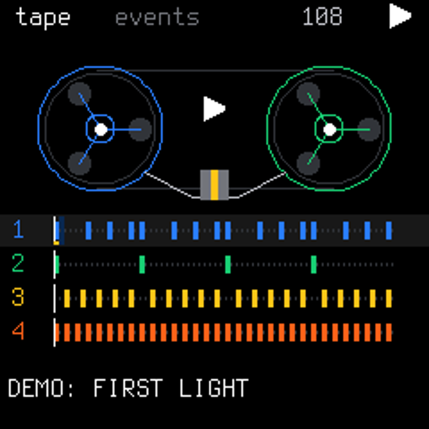
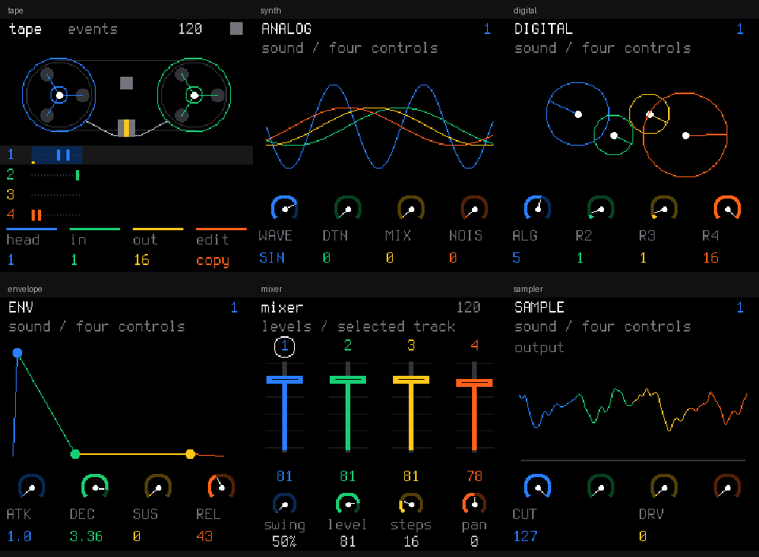
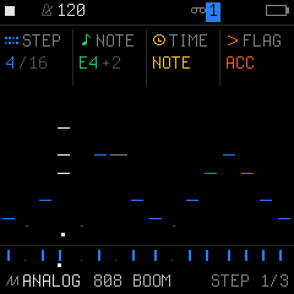
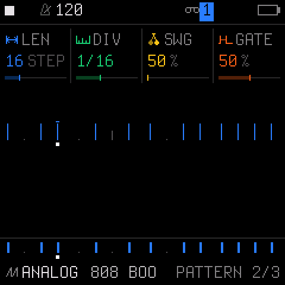
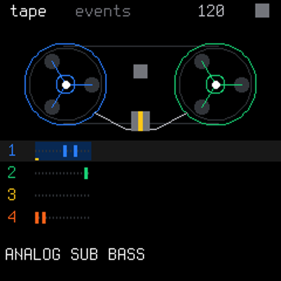

# ORBIT

**An experimental groovebox firmware for the FM-1, built on SLOOP/Felucca.**

ORBIT combines the existing synth, sampler and sequencer with an event Tape workflow and original graphics inspired by the OP-1's four-colour controls. Current development version: **0.3.0**.

> Development status: host tests pass, but the pi32v2 target build and real FM-1 validation are pending. No installable firmware package is provided. Bluetooth headphone pairing and audio output are not implemented.

## Independent sound engines (0.3.0)

ORBIT now has independently written SWARM (six detuned harmonic oscillators), PULSE (dual pulse oscillators with PWM and edge correction), and FM4 (four sine operators with three routing choices). These are original implementations of synthesis families documented for the original OP-1, not ports of Teenage Engineering algorithms or factory sounds.

The first 12 PRESETS entries are new ORBIT sounds. New/empty projects start with FM4 / ORBIT ROUND, SWARM / ORBIT HAZE and PULSE / ORBIT PWM. Existing saved projects retain their legacy engines and sound parameters.



[Listen to the C DSP demonstration](docs/audio/orbit-engines-0.3.mp3): SWARM / ORBIT HAZE, PULSE / ORBIT PWM, then FM4 / ORBIT TINES (three seconds each). This is host-rendered audio, not a recording of OP-1 or FM-1 hardware.

Read [engine feasibility, controls and limitations](docs/OP1-ENGINES.md) for what is implemented, deferred and unknown. The voice allocator, envelope, mixer, effects, sample assets and sequencing infrastructure remain derived from SLOOP/Felucca. The new oscillator algorithms and twelve patch definitions are in `firmware/src/eng_orbit.c`.

## Built-in demo song: FIRST LIGHT

Load it through **hold HOME → DEMO SONG → OCT+ → OCT+ again**, then press **PLAY**. Stop playback first. The first confirmation shows AGAIN; OCT− cancels. Loading replaces the current working patterns and sounds, so save work you want to keep beforehand. Numbered project slots are not written by the loader; normal working-project autosave still applies.

FIRST LIGHT is an original four-bar, 64-step loop at 108 BPM: Am7 → Fmaj7 → Cmaj7 → G7. It combines FM4 / ORBIT ROUND bass, SWARM / ORBIT HAZE sustained chords, PULSE / ORBIT PIN melody and the existing synthesised 808 drums. The notes, dynamics, chords and ties remain fully editable. It is not a prerecorded backing track or a multi-section arrangement.

[Listen to FIRST LIGHT](docs/audio/orbit-first-light.mp3) (actual C sequencer/DSP render).



## Screens

These images are rendered by the actual firmware UI in the native host harness, using representative test patterns. They are not photographs of an FM-1 or design mockups.



### Step sequencer

The existing SLOOP piano-roll sequencer is retained. The capture below shows a 16-step pattern with a chord, note parameters and an accent.



### Pattern view



## Features and current progress

| Area | Status | Details |
|---|---|---|
| Event Tape | Implemented; host tested | Four-track event timeline, transport position, inclusive region selection, COPY / LIFT / DROP |
| Tape editing | Implemented; host tested | Preserves chords, ties, velocity and ratchets; clips at the pattern boundary and checks synth/drum compatibility |
| Synths | Three independent ORBIT engines added | SWARM, PULSE and FM4, with 12 original presets; nine legacy engines retained for compatibility |
| Sampler | Existing functionality retained | Three user slots; sample import, CHOP and device upload through the original web editor |
| Sequencer | Existing functionality retained | Up to 64 steps, live recording, chords, ratchets, drum lanes and song arrangement |
| Graphics | Implemented; host tested | Two Tape reels, coloured synth graphics, envelope curves and four mixer faders |
| Mixer | Existing functionality retained | Track levels, pan, mute, solo and effects |
| Project storage | Existing format retained | FUN4 projects; Tape selection and clipboard are temporary |
| Native preview | Implemented; host tested | Browser controls backed by the firmware's actual C DSP, sequencer and UI |
| Divide-by-zero trap mitigation | Applied; host register test passed | Explicitly clears EMU_CON bit 2 during IRQ initialisation |
| Target firmware build | Pending | Requires the JieLi pi32v2 toolchain and AC79 SDK |
| Real FM-1 validation | Pending | Boot, memory budget, IRQ timing, controls, USB and sample upload still need hardware checks |
| Bluetooth headphones | Not implemented | Pairing, reconnect and Bluetooth audio require further SDK integration and device testing |
| PCM audio Tape | Not implemented | Tape edits note/drum events; it does not record long audio or provide tape-speed pitch changes |

The SAMPLE/GRAIN scope displays the actual **master audio output**, rather than a raw sample waveform for trim editing. Synth graphics visualise parameters. ORBIT uses original graphics and does not include OP-1 artwork, audio or logos.

HOME now briefly displays the loaded engine and preset after turning PRESETS. It browses individual sounds rather than only the first sound of each category.



## Development milestones

- **0.1:** Added event Tape editing, native firmware rendering and the browser preview.
- **0.2:** Added reel, oscillator/orbit, envelope and mixer graphics; connected the preview scope to the actual mixed audio.
- **0.2.1:** Applied the divide-by-zero trap mitigation and captured STEP/PATTERN screens.
- **0.3.0:** Added independent SWARM, PULSE and FM4 engines, 12 original patches and independent defaults; verified native DSP and wasm32 integration.
- **Next:** Complete target compilation and memory/timing checks, then validate on FM-1 hardware. Bluetooth support remains a separate development task.

## Try the native preview

Requirements: Python 3, a C compiler (`gcc` or `cc`) and Pillow. Node.js is used for browser script syntax checks.

```bash
python -m pip install -r requirements.txt
python tools/orbit_preview.py --port 8080
```

Open http://127.0.0.1:8080 and press the audio-start button. The preview includes a demo pattern; the firmware boot project does not.

The preview uses the firmware DSP but buffers approximately 250–550 ms of browser audio, so it cannot establish device performance or playing latency. Its project save/load doubles are nonpersistent. Uploading user samples into the preview process is not supported.

## FM-1 controls

| Control | HOME / event Tape action |
|---|---|
| KNOB 1 | Set the paste destination (head) |
| KNOB 2 / 3 | Set region start / end, including both endpoints |
| KNOB 4 | Select COPY or LIFT |
| OCT− | Copy or lift the selected region |
| OCT+ | Drop the clipboard at the head; overwrite destination events |
| PRESETS | Browse individual sounds; HOME briefly shows the loaded engine and preset |
| ALGORITHM | Select a track |
| SELECT | Adjust BPM |
| PLAY / REC | Existing transport / live recording |
| EDIT / SEQ / GLO | Sound editing / step sequencer / mixer |
| Hold HOME | Existing settings menu |

Synth clips can move between synth tracks. Drum clips can only be dropped onto the drum track. Synth LIFT participates in the existing EDIT+OCT− undo path. A lifted drum region can be restored by dropping the clipboard; copying another region replaces that clipboard. Outside HOME, the existing OCT± controls remain available.

For sample import and CHOP editing, use `web/editor.html`. Device communication uses the original SLOOP Web MIDI workflow and browser requirements; see [the upstream README](README-SLOOP.md).

## Validation

```bash
python tools/orbit_check.py
python tools/orbit_preview.py --port 8080
# Stop the preview after its first native build, then run:
python tests/orbit_preview_test.py
```

The 0.2.1 host checks passed **11 test programs**, covering IRQ initialisation, recovery, Tape editing, panel input, sequencer behaviour, projects, storage, drums, recording, song audio and UI bounds. Native HTTP preview integration, non-silent 44.1 kHz stereo output, input rejection and JavaScript syntax checks passed during preview development. The existing web editor suite also passed; package checks were skipped because no target firmware package exists.

See [validation details](docs/VALIDATION.md) for evidence and limitations. Host results do not establish target boot safety, RAM/flash usage or real-time audio performance.

### Boot exception mitigation

Following the upstream Felucca #61 / #111 mitigation, `fm1_irq_init` explicitly clears EMU_CON bit 2, including a stale setting from a previous boot. Other register bits, exception configuration, vectors and branch tracing are preserved.

The test runs the actual initialisation function against RAM-backed MMIO on Linux and checks cold/warm states and repeated initialisation. Disabling the trap does not fix arithmetic errors or guarantee safe boot on hardware; target compiler and device validation are still pending.

## Build for FM-1

Follow [BUILDING.md](BUILDING.md) for the JieLi pi32v2 Linux toolchain and AC79 SDK requirements.

```bash
export JIELI_TOOLCHAIN=/path/to/jieli/toolchain
export AC79_SDK=/path/to/AC79_SDK
python tools/build.py
```

The inherited output filename is `build/felucca.fwsc`. No such installable package is included in this repository. The target toolchain and SDK were unavailable in the development environment.

## Origin and licensing

Based on [isod89/sloop-fm1](https://github.com/isod89/sloop-fm1) at commit `d691ba7b2d922f1a1f41a3622cffe29ce41c5506`. This is an independent repository created from a pinned source snapshot, rather than a fork containing the full upstream Git history.

Software is **GPL-3.0-only**. Original copyright notices and licence files are retained. Fonts and sample assets have their own licensing terms; see [LICENSING.md](LICENSING.md) and the notices in the asset directories. The original project documentation is preserved in [README-SLOOP.md](README-SLOOP.md).
