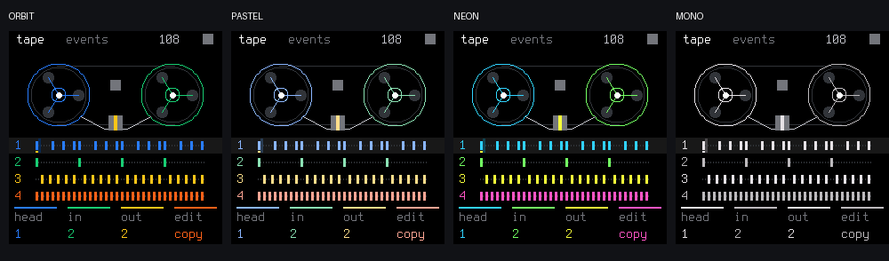
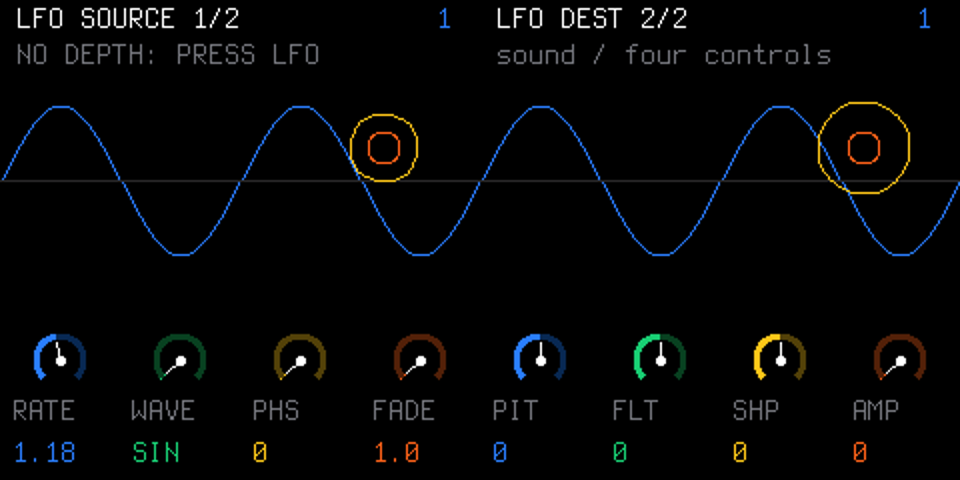

# ORBIT

**An experimental groovebox firmware for the FM-1, built on SLOOP/Felucca.**

ORBIT combines the existing synth, sampler and sequencer with an event Tape workflow and original graphics inspired by the OP-1's four-colour controls. Current release version: **0.5.0**.

> Current status: the pi32v2 target build, `build/orbit.fwsc` generation and installation format checks are complete. **On 2026-10-10, ORBIT 0.5.0 was installed on a physical FM-1; automatic reboot, USB INFO/PING and unchanged existing backup data were confirmed, and the user reported normal operation.** Hardware audio timing, USB 48 kHz transfer, long-term stability and recovery remain unverified. Existing PHASE CPU and ALNK0 ISR budget overruns were resolved without changing baselines or tolerances. See the [validation record](docs/VALIDATION.md) for the current results and the [earlier 0.4.1 installation](#hardware-installation-test-2026-10-09) for its historical scope. Bluetooth headphones are not implemented.

The web interface starts in English and displays an ultrathin `Orbit` wordmark instead of the Sloop logo. The firmware first displays an `Orbit` boot screen with 1-pixel strokes, then draws the normal UI after at least 750 ms. No new framebuffer or PCM buffer was added.

## 0.5.0 release

Get [`orbit.fwsc`](https://github.com/dspaudio/orbit/releases/download/v0.5.0/orbit.fwsc) and [`SHA256SUMS`](https://github.com/dspaudio/orbit/releases/download/v0.5.0/SHA256SUMS) from the [ORBIT 0.5.0 release](https://github.com/dspaudio/orbit/releases/tag/v0.5.0). The [0.5.0 release notes](docs/releases/0.5.0.md) cover the new engines, the 77 new sounds, SYN, USB 48 kHz, the web editing features, installation and validation limits. The separate web emulator isn't deployed as part of this firmware release.

### ORBIT 0.5.0 / SLOOP 2.5 integration

We compared all 72 changed paths from SLOOP v2.4.1 to v2.5 and brought in PHYS and NOISE, 77 new sounds, SYN1-SYN4, USB 44.1/48 kHz, drum delay, MIDI CC, an independent metronome, the STEP chord entry fix, and web piano roll, MIDI file, Song and DX7 cartridge editing. The default factory bank has 165 sounds, and the existing ORBIT engine IDs, first 12 sounds, Event Tape and 3,840 B FUN5 are unchanged. The button and page label is SEL, swing shows 0-100, and the editor protocol is v10.

0.5.0 is a **new version, separate from the 0.4.1 package** linked below. On 2026-10-10 the source version and the native preview and web mock labels were raised to **0.5.0**, and the firmware was installed on the user's FM-1. The write reached 100%, the device rebooted on its own, and it answered INFO as `FELUCCA ORBIT 0.5.0` with protocol v10, 15 engines and 33 globals, plus a working PING. All 13 objects of the original backup were bit-identical before and after installation, and the user confirmed normal operation. Private backups and work journals aren't published.

The integration passed the full host, sanitizer and 194 golden/CPU regression checks. After the version bump, the 21 `orbit_check` cases, native preview, web, installer simulator and a real pi32v2 build passed again. Target RAM is 85,892/98,304 B and pool is 333,948/344,064 B. Hardware audio timing, 48 kHz transfer and long-term stability remain unverified. See the [SLOOP 2.5 integration notes](docs/SLOOP-2.5-INTEGRATION.md) for what was applied or excluded and how to use it, and the [validation record](docs/VALIDATION.md) for measurements and limits.

## 0.4.1 release (previous version)

Download the previous installation package [`orbit.fwsc`](https://github.com/dspaudio/orbit/releases/download/v0.4.1/orbit.fwsc) from the [GitHub release](https://github.com/dspaudio/orbit/releases/tag/v0.4.1). The [web emulator](https://dspaudio.github.io/orbit-web-emu/) runs its separately deployed C firmware as WebAssembly. See the [release notes](docs/releases/0.4.1.md) for changes and installation/validation limitations.

The original OP-1's Synth / Drum / Event Tape / Mixer workflow, T1–T4 sound modules and blue / green / white / orange encoder roles are reflected in the controls. The mixer provides LEVEL / PAN and the existing TRACK editing controls. PHASE and ALNK0 budget overruns were resolved without changing existing baselines. The FUN5 save format and editor protocol v9 are preserved.

## Color styles and SLOOP 2.4.1 integration (0.4.0)

Issue [#1](https://github.com/dspaudio/orbit/issues/1) proposed a cleaner display and newer SLOOP/Felucca features. ORBIT keeps its four-color identity and makes monochrome optional. Hold HOME, leave it released, select **SCREEN** with SELECT, and turn **KNOB1 / STYLE**. **ORBIT** is the fresh-device default; **PASTEL**, **NEON**, **MONO**, GREEN, AMBER, CYAN and RED are available. Track and knob colors change together; labels, track numbers and position markers remain visible in every style. Close with OCT− to save the setting. Existing saved style selections are preserved.



Integrated from upstream tag **v2.4.1**, commit `a1c5d68767ae10fafb6821dc63b9b1fc490342d2`:

| Feature | ORBIT 0.4.0 status |
|---|---|
| FM6 | Six operators, 32 algorithms, eight factory patches, 27 bank slots; 2.4.1 AMS fix included |
| DX7 patches | Single-voice / 32-voice SysEx import and operator editing through the Web MIDI editor |
| Sequencer | 24 parameter locks per track, micro timing (−32…31), fill / no-fill conditions, longer step divisions |
| Chords | Live chord modifiers, inversions, ±60 ms strum and voice leading |
| Performance | Quick pattern chains, LP/HP track filter, dotted delays, MIDI SEQ output and clock-only input |
| Samples and drums | USR4 and four user drum-kit slots; combined USR3+4 kits through the editor |
| Display and controls | 12 audio visualizers, SELECT page navigation, larger readouts, grouped settings and ALL KEYS lighting |
| Editor | Updated pixel interface, drum-kit builder, locks, nudges, fills and FM6 patch tools |
| USB | Upstream USB SERIAL default OFF and count-in / note-off fixes |

Tap HOME while on the event Tape to open the visualizer; turn SELECT for its style, then tap HOME to return. SAVE tapped from HOME opens SONG; from an editing page it opens SAVE / PRESETS. Hold SAVE for the section/chain layer. The first twelve PRESETS entries remain the independent ORBIT sounds; the complete factory bank now has 88 entries.

ORBIT engine IDs 0…11 remain unchanged; FM6 is appended as **12** (13 with the optional SLICE engine). Existing ORBIT 0.3 FUN4 projects migrate to FUN5 while retaining engine IDs, notes and sound parameters. Tape COPY / LIFT / DROP also carries nudges, fill conditions and remapped parameter locks. A drop that would exceed the 24-lock limit fails without changing the destination. Synth Tape's EDIT+OCT− Undo and EDIT+OCT+ Redo restore note events together with nudges, fill conditions and parameter locks.

**Save a backup before downgrading:** FUN5 files cannot be loaded by ORBIT 0.3 / SLOOP 2.3. SLOOP 2.4 uses a different engine registry (FM6=9), so its raw project/backup images are not interchangeable with ORBIT 0.4. The editor discovers engine IDs by name for patch-library conversion. USB/editor transfers and custom sample uploads are implemented for the firmware but remain unavailable in the emulator HAL.

## Independent sound engines (0.3.0)

ORBIT now has independently written SWARM (six detuned harmonic oscillators), PULSE (dual pulse oscillators with PWM and edge correction), and FM4 (four sine operators with three routing choices). These are original implementations of synthesis families documented for the original OP-1, not ports of Teenage Engineering algorithms or factory sounds.

The first 12 PRESETS entries are new ORBIT sounds. New/empty projects start with FM4 / ORBIT ROUND, SWARM / ORBIT HAZE and PULSE / ORBIT PWM. Existing saved projects retain their legacy engines and sound parameters.


[Listen to the C DSP demonstration](docs/audio/orbit-engines-0.3.mp3): SWARM / ORBIT HAZE, PULSE / ORBIT PWM, then FM4 / ORBIT TINES (three seconds each). This is host-rendered audio, not a recording of OP-1 or FM-1 hardware.

Read [engine feasibility, controls and limitations](docs/OP1-ENGINES.md) for what is implemented, deferred and unknown. The voice allocator, envelope, mixer, effects, sample assets and sequencing infrastructure remain derived from SLOOP/Felucca. The new oscillator algorithms and twelve patch definitions are in `firmware/src/eng_orbit.c`.

## LFO controls (0.3.1)

LFO has two pages. **LFO SOURCE 1/2** controls RATE, WAVE, PHASE and FADE; these define the modulation signal, not its strength. Press LFO again for **LFO DEST 2/2**: PIT (pitch), FLT (tone/filter), SHP (engine shape) and AMP (amplitude) depths. A source with all four depths at zero does not change the sound. The first page displays `NO DEPTH: PRESS LFO` in that case.

For a clear first test, set LFO DEST KNOB4 / AMP to about 50%, then return to SOURCE and adjust RATE and WAVE while holding a note. PHASE is the starting phase of a new phrase; release all notes and retrigger to hear its change. FADE introduces modulation gradually after retrigger.

SHP now modulates harmonic balance in SWARM, pulse width in PULSE, and operator modulation depth in FM4. Patch defaults remain unmodulated unless a destination depth is enabled.



## Built-in demo song: FIRST LIGHT

Load it through **hold HOME → SELECT: SYSTEM → PRESETS: DEMO SONG → OCT+ → OCT+ again**, then press **PLAY**. Stop playback first. The first confirmation shows AGAIN; OCT− cancels. Loading replaces the current working patterns and sounds, so save work you want to keep beforehand. Numbered project slots are not written by the loader; normal working-project autosave still applies.

FIRST LIGHT is an original four-bar, 64-step loop at 108 BPM: Am7 → Fmaj7 → Cmaj7 → G7. It combines FM4 / ORBIT ROUND bass, SWARM / ORBIT HAZE sustained chords, PULSE / ORBIT PIN melody and the existing synthesised 808 drums. The notes, dynamics, chords and ties remain fully editable. It is not a prerecorded backing track or a multi-section arrangement.

[Listen to FIRST LIGHT](docs/audio/orbit-first-light.mp3) (actual C sequencer/DSP render).


## Screens

These images are rendered by the actual firmware UI in the native host harness, using representative test patterns. They are not photographs of an FM-1 or design mockups.


### Step sequencer

The existing SLOOP piano-roll sequencer is retained. The capture below shows a 16-step pattern with a chord, note parameters and an accent.


### Pattern view


## Features and current progress

| Area | Status | Details |
|---|---|---|
| Event Tape | Implemented; host tested | Four-track event timeline, transport position, inclusive region selection, COPY / LIFT / DROP |
| Tape editing | Implemented; host tested | Preserves chords, ties, velocity, ratchets, nudges, fills and locks; clips at the pattern boundary and checks synth/drum compatibility |
| Synths | 15 engines in the default build | SWARM, PULSE and FM4 with 12 original presets, plus the retained engines, FM6, PHYS and NOISE; 165 factory sounds total |
| Sampler | Existing functionality retained | Four user slots; sample import, CHOP and device upload through the original web editor |
| Sequencer | Existing functionality retained | Up to 64 steps, live recording, chords, ratchets, drum lanes and song arrangement |
| Graphics | Implemented; host tested | Two Tape reels, coloured synth graphics, envelope curves and four mixer faders |
| Mixer | Implemented; host tested | Four-track LEVEL / PAN, selected-track editing, mute, solo and effects |
| Project storage | FUN5 retained | Reads older FUN1–FUN4 projects; Tape selection and clipboard are temporary |
| Native preview | Implemented; host tested | Browser controls backed by the firmware's actual C DSP, sequencer and UI |
| Divide-by-zero trap mitigation | Applied; host register test passed | Explicitly clears EMU_CON bit 2 during IRQ initialisation |
| Target firmware build | Build and package verified | pi32v2 compile, ELF memory and static ISR budgets checked |
| Real FM-1 validation | 0.5.0 installation and reboot tested (2026-10-10) | USB INFO/PING and unchanged existing data confirmed, plus user confirmation of normal operation; audio/IRQ timing, long-term stability, recovery and sample upload remain unverified |
| Bluetooth headphones | Not implemented | Pairing, reconnect and Bluetooth audio require further SDK integration and device testing |
| PCM audio Tape | Not implemented | Tape edits note/drum events; it does not record long audio or provide tape-speed pitch changes |

The SAMPLE/GRAIN scope displays the actual **master audio output**, rather than a raw sample waveform for trim editing. Synth graphics visualise parameters. ORBIT uses original graphics and does not include OP-1 artwork, audio or logos.

HOME now briefly displays the loaded engine and preset after turning PRESETS. It browses individual sounds rather than only the first sound of each category.


## Development milestones

- **0.1:** Added event Tape editing, native firmware rendering and the browser preview.
- **0.2:** Added reel, oscillator/orbit, envelope and mixer graphics; connected the preview scope to the actual mixed audio.
- **0.2.1:** Applied the divide-by-zero trap mitigation and captured STEP/PATTERN screens.
- **0.3.0:** Added independent SWARM, PULSE and FM4 engines, 12 original patches and independent defaults; verified native DSP and wasm32 integration.
- **0.4.1:** Original OP-1 control roles, Orbit branding, preview input fixes and PHASE/ISR budget fixes; install package and updated WebAssembly emulator.
- **0.5.0:** SLOOP 2.5 integration: PHYS/NOISE, 77 sounds, SYN kits, USB 48 kHz, drum delay/CC/click and web piano roll/MIDI/Song/DX7; hardware installation and data preservation confirmed.
- **Next:** Measure hardware audio/IRQ timing, 48 kHz transfers, long-term stability and recovery.

## Try the native preview

Requirements: Python 3, a C compiler (`gcc` or `cc`) and Pillow. Node.js is used for browser script syntax checks.

```bash
python -m pip install -r requirements.txt
python tools/orbit_preview.py --port 8080
```

Open http://127.0.0.1:8080 and press the audio-start button. The preview includes a demo pattern; the firmware boot project does not.

The preview uses the firmware DSP but buffers approximately 250–550 ms of browser audio, so it cannot establish device performance or playing latency. Its project save/load doubles are nonpersistent. Uploading user samples into the preview process is not supported.

The preview supports button taps only. Holding HOME and layer combinations are available on the hardware. Controls including SEL and SELECT, short key presses and the Visualizer's left/right taps are connected to the actual C input/output paths.

## FM-1 controls

| Control | HOME / event Tape action |
|---|---|
| KNOB 1 | Set the paste destination (head) |
| KNOB 2 / 3 | Set region start / end, including both endpoints |
| KNOB 4 | Select COPY or LIFT |
| OCT− | Copy or lift the selected region |
| OCT+ | Drop the clipboard at the head; overwrite destination events |
| PRESETS | Browse individual sounds; HOME briefly shows the loaded engine and preset |
| ALGORITHM | Select a track |
| SELECT | Adjust BPM |
| PLAY / REC | Existing transport / live recording |
| EDIT / SEQ / GLO | Sound editing / step sequencer / mixer |
| Hold HOME | Existing settings menu |

Press GLO on Tape to open the actual track mixer; press GLO again in the mixer to open global settings. Press EDIT or SEQ on the drum track's Tape to open the DRUMS page.

The main workflow on the display and web interface is **Synth / Drum / Event Tape / Mixer**. The original OP-1's T1 engine / T2 envelope / T3 effect / T4 LFO correspond to the FM-1's **EDIT / ENV / FX / LFO**, with the four encoders ordered **blue / green / white / orange**. Existing detail pages opened by repeated presses and hold layers are preserved. In the mixer, SELECT cycles through four-track LEVEL → four-track PAN → the existing selected-track controls (SWING / LEVEL / LEN / PAN).

The native preview displays mode selection from the actual C state, and Event Tape in the web editor opens the existing sequencer event editor. Drum uses track 4's actual editing path. Engine selection and selection from the complete sound preset bank remain separate; PCM Tape recording, audio overdubbing and album features are not added. The design follows [DESIGN.md](DESIGN.md) and the [official original OP-1 guide](https://teenage.engineering/guides/op-1/original).

Synth clips can move between synth tracks. Drum clips can only be dropped onto the drum track. Synth LIFT participates in the existing EDIT+OCT− undo path. A lifted drum region can be restored by dropping the clipboard; copying another region replaces that clipboard. In the Visualizer, OCT± also adjusts the octave without modifying Tape or the clipboard. Outside HOME, the existing OCT± controls remain available.

For sample import and CHOP editing, use `web/editor.html`. Device communication uses the original SLOOP Web MIDI workflow and browser requirements; see [the upstream README](README-SLOOP.md).

## Validation

```bash
python tools/orbit_check.py
python tools/orbit_preview.py --port 8080
# Stop the preview after its first native build, then run:
python tests/orbit_preview_test.py
```

On Linux amd64, the **21 host programs** in `tools/orbit_check.py` and the full `sh tests/run_tests.sh` under Node 24 passed. The macOS instruction-counted CPU/golden run passed with 194 renders, no changed or missing references and no CPU budget overruns. ALNK0's static cost is 138 against the existing baseline of 174. Neither CPU baselines nor tolerances were relaxed. Web, installation CLI and native HTTP checks, plus actual browser interactions at 1440px / 390px, were verified. Package checks cover the CRC, loader marker and matching Python/JavaScript logical images for `orbit.fwsc`.

See [validation details](docs/VALIDATION.md) for evidence and limitations. Host results do not establish target boot safety, RAM/flash usage or real-time audio performance.

### Hardware installation test (2026-10-09)

The ORBIT 0.4.1 package `build/orbit.fwsc`, built from source commit `3074510`, was installed on a physical FM-1 that had been running SLOOP 2.4.1 normally, using `python tools/fm1_install.py build/orbit.fwsc --port Felucca --yes`. The package CRC was checked before installation. Writing reached 100%, the device rebooted automatically and the installer returned exit code 0. After reboot, the device's INFO response was `FELUCCA ORBIT 0.4.1` and its PING response was `[0]`. The user confirmed the ORBIT display and button/knob responses. The device did not become unresponsive during this installation.

The tested package's SHA-256 is `40f238815bcd0864fbfdfee53854c58f7641d0ef20e350855e7f5d73389ff39b`. This confirms installation and boot for that package and device, not operation on every FM-1. Audio output, real-time audio/IRQ timing, long-term stability, sample upload and recovery after a failure were not verified by this test. Attempts to enter recovery by holding OCT− while powering on showed the normal screen, so hardware recovery is not recorded as successful.

### Boot exception mitigation

Following the upstream Felucca #61 / #111 mitigation, `fm1_irq_init` explicitly clears EMU_CON bit 2, including a stale setting from a previous boot. Other register bits, exception configuration, vectors and branch tracing are preserved.

The test runs the actual initialisation function against RAM-backed MMIO on Linux amd64 and checks cold/warm states and repeated initialisation. Target compilation is complete, but this host test does not establish hardware boot safety. The validation log distinguishes macOS MMIO test compilation limitations from areas that remain unverified on hardware.

## Build for FM-1

Follow [BUILDING.md](BUILDING.md) for the JieLi pi32v2 Linux toolchain and AC79 SDK requirements.

```bash
export JIELI_TOOLCHAIN=/path/to/jieli/toolchain
export AC79_SDK=/path/to/AC79_SDK
python tools/build.py
```

The installable output filename is `build/orbit.fwsc`. Generated packages are not committed to this repository.

## Origin and licensing

Based on [isod89/sloop-fm1](https://github.com/isod89/sloop-fm1), originally commit `d691ba7b2d922f1a1f41a3622cffe29ce41c5506` (v2.3), with the v2.4.1 changes integrated in ORBIT 0.4.0. This is an independent repository created from a pinned source snapshot, rather than a fork containing the full upstream Git history.

Software is **GPL-3.0-only**. Original copyright notices and licence files are retained. Fonts and sample assets have their own licensing terms; see [LICENSING.md](LICENSING.md) and the notices in the asset directories. The original project documentation is preserved in [README-SLOOP.md](README-SLOOP.md).
